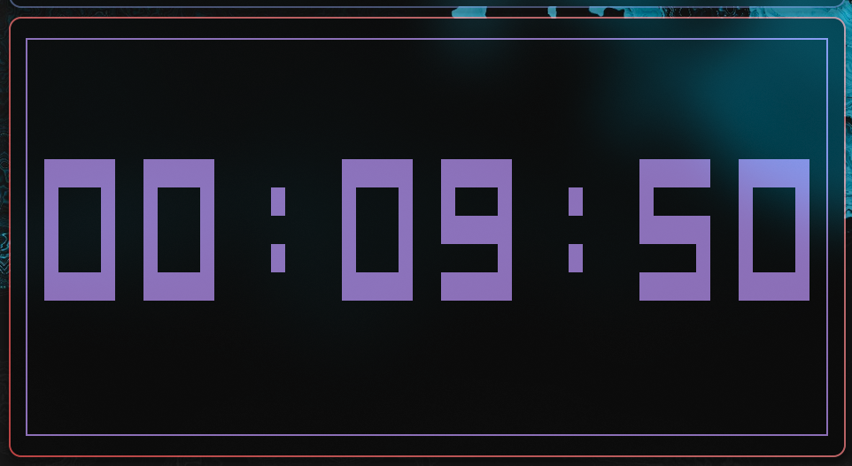

<h1 align="center"> Xclock </h1>

<div align="center">

  

xclock is a terminal-based clock application written in Rust, inspired by `ttyclock`. It features a digital clock with ASCII art, countdown timers, and various customization options.

<p align="center">  </p>

</div>

## Preview

<p align="center">
  <a href="./assets/previews/preview01.png">
    
  </a>
</p>

## Features

- **Clock Mode**: Displays current time with seconds.
- **Countdown Mode**: Set a timer using formats like `5m`, `1h30m`, `10s`.
- **Customization**:
  - Center alignment.
  - Colors (red, green, blue, yellow, cyan, magenta, white, black).
  - 12/24 hour format.
  - Toggle seconds (`-s` to show).
  - Hide/Show box borders.
- **Cross-platform**: Works on Linux, macOS, and Windows.

## Installation

### Linux / macOS

You can install xclock using the provided script. It will auto-detect your OS (Arch/Ubuntu/Fedora/macOS), install Rust if missing, and then install xclock:

```bash
./install.sh
```

Or remotely:
```bash
wget -O - https://raw.githubusercontent.com/xscriptor/xclock/main/install.sh | bash
```

### Windows

Run the PowerShell script:

```powershell
./install.ps1
```

### Uninstallation

- Linux/macOS: `./uninstall.sh`
- Windows: `./uninstall.ps1`

## Usage

```bash
xclock [OPTIONS]
```

### Options

| Option | Description |
|--------|-------------|
| `-c`, `--center` | Center the clock on the screen |
| `-C`, `--countdown <TIME>` | Enable countdown mode (e.g., `5m`, `1h30m`) |
| `-s`, `--seconds` | Show seconds (default: off) |
| `-r`, `--color <COLOR>` | Set color (default: green) |
| `-t`, `--twelve-hour` | Use 12-hour format |
| `-B`, `--no-box` | Hide the box borders |
| `-h`, `--help` | Print help |

Seconds are disabled by default to mimic `ttyclock`. Use `-s` to show them.

### Examples

Run a centered green clock:
```bash
xclock -c -r green
```

Run a 5-minute countdown:
```bash
xclock -C 5m
```

Run a clock without box and seconds:
```bash
xclock -B
```

## Development

Built with Rust, using `ratatui` and `crossterm`.

```bash
cargo run --release
```
